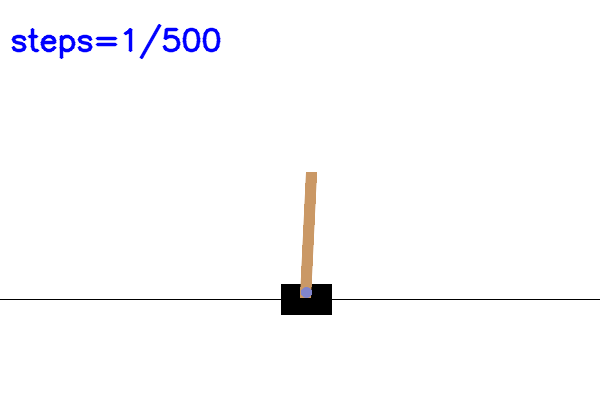

# installation
Install swig: `brew install swig` (needed for gymnasium[box2d])
```
python3 -m venv env
source env/bin/activate
env/bin/python3.11 -m pip install -r requirements.txt
```


# OpenAI RL problems

Recently, I have been reading up on reinforcement learning with Stanford's CS234 RL course. I liked it so much I took notes and put it up on my blog, check it out [here](https://timothydelille.com/notes/stanford-cs234-reinforcement-learning-lecture-2).

## Cartpole
I implemented Monte Carlo sampling and Q learning for the cartpole environment in `cartpole.ipynb`.



The pole is balanced! 🤩

## Car racing
To play with the car racing game: `env/lib/python3.11 env/lib/python3.11/site-packages/gymnasium/envs/box2d/car_racing.py`